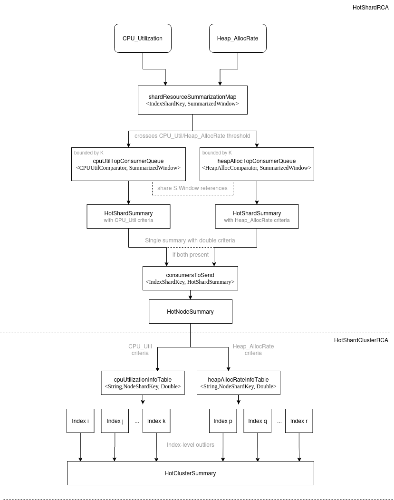

# Hot Shard RCA

## Definition

The idea behind HotShard RCA is to identify a hot shard within an index. A Hot shard is a resource consuming outlier within its counterparts. The RCA subscribes to following metrics:

1. `CPU_Utilization`
2. `Heap_AllocRate`.

The RCA looks at the above two metric data and compares the values against the threshold for each resource and if the usage for any of the resources is greater than their individual threshold, we mark the context as 'UnHealthy' and create a `HotShardResourceSummary` for the shard.

In order to have a full picture of the index-level shard stats, and to detect outliers, cluster variant - `HotShardClusterRCA` is to be used as a downstream RCA to the `HotShardRCA`s running on each Data node.

In the future, some metric dependent on disk read/write intensity is to be considered, potential candidates being:
1. `Thread_Blocked_Time`
2. `IO_TotThroughput `

## Implementation overview

In every RCA period, all existing shards are taken into account within this RCA. As this number can go up to 1000 per Node and thus can create huge memory footprint for both the Cluster Manager and Data nodes, if implementation is handled naively.

To minimize the core of the footprint (memory allocated for the whole duration of each RCA period which directly scales with number of shards), a single map, mapping unique Index - Shard combination to the highly specific structure, called `SummarizedWindow`, is used.

HotShardRCA period consists of `SLIDING_WINDOW_IN_SECONDS/5` (default being `12`) operate ticks, each of them consuming metric aggregations from previous `5` seconds, more precisely the `SUM` aggregation of each metric. `SummarizedWindow` accumulates these aggregation over the period of `SLIDING_WINDOW_IN_SECONDS` (by default 1 minute) and is later used to calculate the over time average of these accumulated metrics. Note that summarization would give us a little less information than the average value as some shards may start or stop being active anywhere inside the RCA period. This is why more general case structures like `SlidingWindow` offer us a granularity that we don't need and by omitting them, considerable amount of heap is saved. Also, inside the same single `SummarizedWindow`, all metrics are getting aggregated at once, this way eliminating duplicated timestamps and shard identification data.

In high workload enviroments, there is a possibility for the worst case scenario, where all the shards present on cluster become candidates and must be sent to the Cluster Manager and thus potentially creating high network traffic as well as very high heap usage on the Cluster Manager node that is supposed to collect all the cluster data. To account for this possiblity, Top-K consumers heuristic is used.

Top-K consumers is setting a limit to a maximum number of Hot Shards being sent over the network to the cluster Manager. This is also configurable through .conf files, default being `50`. The idea is that we have a `K << N` for extreme `N`'s where `N` represents number of shards on Node.

The Top-K heuristic is done by triage-like process on map iteration. Each shard that crosses a certain metrics threshold goes into one of two bounded `MinMaxPriorityQueue`s (a queue for each metric, and their capacities limited by K parameter), note that one shard can end up in both queues if both of its metrics cross their respective thresholds. This way, during the process, only the consumers that have a chance of being sent to the Cluster Manager are being stored plus saving memory and having a memory size - fixed structure under the queues' implementations. We also pass references to the same `SummarizedWindow` structures to both queues and only give them different comparator objects, this also saves heap. At the end, union of queues' elements is being created, and it will form the summaries sent to the `HotShardClusterRCA`. Note that due to reference sharing all metric info is preserved even if consumer is present only in one queue after the triage.

As a final process for a plain Data node `HotShardRCA`, data from queues is converted to Summary objects that are sent to Cluster manager Node for the cluster variant of the analysis. These contain Node, Index, Shard identification, relevant timestamps as well as metric value, threshold and type.

`HotShardClusterRCA`'s responsibility is to collect and triage the data, first by metric type, and then by index. For each index, shards are then sorted by metric values and the median value is calculated. Hot shard criteria is following: All shards that are by threshold (which is in %) 'bigger consumers' than the median of their counterparts, are declared hot and cluster health status and summaries about the shards are created and persisted for later querying.

## Threshold tuning

`HotShardRCA` uses raw metric thresholds to determine the candidate Shards that are sent to the Cluster manager node. There are no universal values that cover all the use-cases, workloads and configurations and these should be set up and monitor carefully by cluster administrators.

As all metrics used by this RCA are time-related (usage ratio for previous period and alloc rate) magnitude of metric values can vary based on multiple factors: type of operations performed on cluster in previous periods, computing power of host machines, even number of nodes.

We provide some benchmarks and conclusions that we base our default thresholds on.
Each of the following benchmarks was performed on empty 2-node docker-deployed clusters. The idea is to perform some kind of operation (Bulk, Index, Search, Update) for each index, sequentially, multiple times. In following runs, there is 500 indexes with 1 shard each (as we first look at `HotShardRCA` only), where indexes from range `[300-399]` perform the concrete operation 10 times more than the rest, this is to spot the behaviour of the raw metric values when intensity of operation increases by order of magnitude.

First run is done by performing bulk requests, 6500 documents for lower and 65000 for higher intensity indexes. Bulk request is a good example for pushing Heap_AllocRate metric to its limits, and here we see multiple shards crossing 1KB/s for mentioned metric.

Good candidate for high CPU_Utilization is the search request run, here few shards even go above 0.1 usage ratio which is achieved by very intense search request operations and as it will later be seen, these results are hard to reproduce in some more realistic workloads.

Note that search request operations can also be heap hungry in some scenarios where more intermediate structures and processing is required during the search period.

In next batch of benchmarks we monitor results from `HotShardClusterRCA` runs.
For these we use 3-node docker-deployed cluster with two Data nodes and one Cluster manager node with no data on it. Now we are putting the load on 100 indexes with 5 shards each, where we plan for ~3 shards to cross the thresholds for `HotShardRCA` and to be sent to cluster variant of analysis.

Next we present `Heap_AllocRate` and `CPU_Utilization` measurements respectively for previously mentioned setup search request load. We specifically index the documents and then perform searches using `routing` query parameter which is dependent on pre-fixed distribution (distribution is created such that one shard is always an outlier) on the fixed distribution .

On both plots we can easily spot the hot shards, their counterparts and their respective values. Dots aligned on the same vertical lines belong to the same index. Bigger dots represent shards declared Hot.

Based on these runs default initial thresholds are set to `0.015` and `1.4E6` for `CPU_Utilization` and `Heap_AllocRate` respectively.

